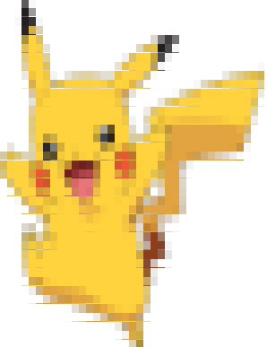

<p float="middle">
  
  
  
  
  
</p>

# PykaDex
Authors: Sudi Ravinthran ([Sudini1412](https://github.com/Sudini1412))\, Ben Shellswell ([Shellywell123](https://github.com/Shellywell123))\
A Python 3 project aiming to optimize nueral networks to indentify different pokemon, with an end goal of hosting a trained model on a server that can be accessed remotely. In the far future we also hope to make custom hardware possibly using ras-pi's and 3D printing to recreate a physical pokedex from the childrens tv series.

## Current Progress 

We have made several attempts at training a model with 10,000 plus photos per pokemon as training data scraped from bing images. The models were not doing aswell as expected, we belive it was due to the training data not being clean enough aswell as neglect of test data sets.

So the next steps we are currently taking are to restructure the training data into training-test sets and clean the data using less images with augmentation techniques. The augmentation techniques involve using transparent images so we can over lay them onto multiple backgrounds as well as random cropping and filters.

## Instructions
The project is currently in development, but feel free to lone and navigate to the repo and install requirements.
```bash
foo@bar:~$ git clone https://github.com/Sudini1412/PykaDex.git

foo@bar:~$ cd PykaDex/ && pip3 install -r requirments.txt
```


## whos_that_pokemon
 Old script (failed) example used for terminal testing of induvidual images.
```bash
 ==============================================================================
 ________  ___    ___ ___  __    ________  ________  _______      ___    ___
|\   __  \|\  \  /  /|\  \|\  \ |\   __  \|\   ___ \|\  ___ \    |\  \  /  /|
\ \  \|\  \ \  \/  / | \  \/  /|\ \  \|\  \ \  \_|\ \ \   __/|   \ \  \/  / /
 \ \   ____\ \    / / \ \   ___  \ \   __  \ \  \ \ \ \  \_|/__  \ \    / /
  \ \  \___|\/  /  /   \ \  \ \  \ \  \ \  \ \  \_\ \ \  \_|\ \  /     \/
   \ \__\ __/  / /      \ \__\ \__\ \__\ \__\ \_______\ \_______\/  /\   \
    \|__||\___/ /        \|__| \|__|\|__|\|__|\|_______|\|_______/__/ /\ __\
         \|___|/                                                 |__|/ \|__|
==============================================================================
Pykadex initialized...
Images you can scan:
 - download.jpg
what image do you want to scan?
download.jpg

==============================================================================
```

```bash
==============================================================================
The image scanned is of a Bulbasaur
==============================================================================
```